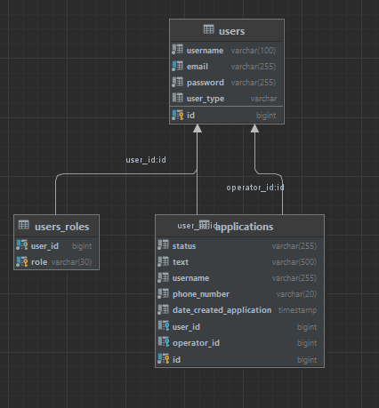

# Light_Digital_test
Тестовое задание на позицию Java-developer в Light_Digital

## Краткое описание
(Техническое задание находится в файле TZ.txt)

Приложение представляет из себя набор сущностей:
- User: как абстрактый класс для SimpleUser и Operator
- SimpleUser как представление пользователей системы
- Operator - представление сущности оператора с возможность
добавления статуса ADMIN

Вход в систему осуществлен через единую точку входа, данные для
входа берутся из SINGLE_TABLE абстрактного класса User.

Схема зависимостей:

## Окружение:

Для старта необходимо в корне проекта создать файл .env,
где указать необходимые значения:

- 'POSTGRES_USERNAME' - имя пользователя для Postgresql
- 'POSTGRES_PASSWORD' - пароль для Postgresql
- 'POSTGRES_DATABASE' - название базы данных Postgresql
- 'JWT_SECRET'

Для визуализации работы добавлена зависимость openAPI(Swagger)
Проверка приложения -> http://localhost:8080/swagger-ui/index.html#/